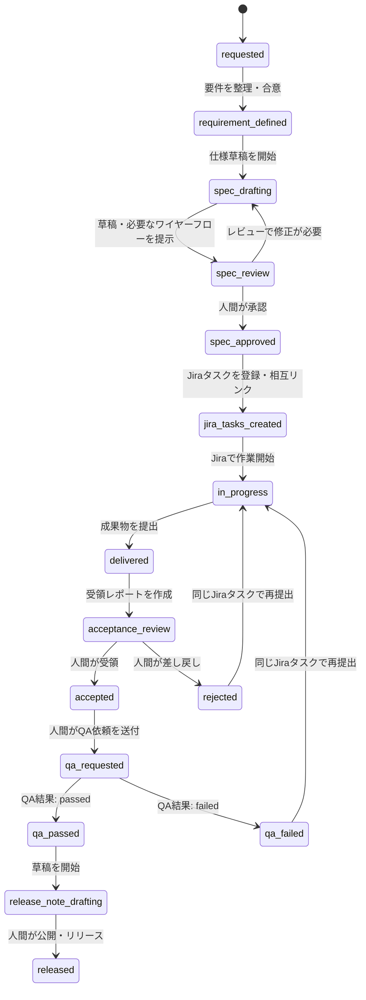

# Work Item ライフサイクル (状態機械)

Work Item ([schemas/work-item.schema.yaml](../../schemas/work-item.schema.yaml)) は、1つの要求・要望が要件化され、仕様化・実装・受領・リリースされるまでの単位を表す。

【決定】この状態機械（状態一覧・遷移ルール）の**定義**の正本はこのリポジトリである（[source-of-truth.md](source-of-truth.md) 参照）。ただし、`in_progress` 配下の個々のJiraチケットの進捗ステータスは引き続きJiraが正本であり、本状態機械はそれらを集約したWork Item全体のライフサイクルを表す。実際のWork Itemインスタンスの状態をどこに永続化するか（DB等）は、この設計フェーズでは未確定（`TBD`、[AGENTS.md](../../AGENTS.md) の「この段階のスコープ」参照）。

## 状態一覧

| 状態 | 説明 | 主な担当 |
|---|---|---|
| `requested` | 要求・要望が寄せられ、まだ整理されていない | PdM/PO |
| `requirement_defined` | 要件として整理・合意された | PdM/PO (Orchestrator支援) |
| `spec_drafting` | 仕様書・ワイヤーフローを草稿中 | Specification Agent |
| `spec_review` | 仕様書がレビュー中 | PdM/PO, 関係者 |
| `spec_approved` | 仕様書が承認された（Notionへ反映） | PdM/PO単独 |
| `jira_tasks_created` | 仕様書からJiraのデザイン・実装タスクへ分解済み | Specification Agent, Orchestrator |
| `in_progress` | Jira上でタスクが進行中 | デザイナー/エンジニア (Jira側で管理) |
| `delivered` | 実装・デザイン成果物が提出された | エンジニア/デザイナー |
| `acceptance_review` | 受領判断を実施中 | Acceptance Agent, PdM/PO |
| `accepted` | 受領判断で合格 | PdM/PO |
| `rejected` | 受領判断で差し戻し | PdM/PO |
| `qa_requested` | QA依頼を作成・送付済み | Release Agent, PdM/PO |
| `qa_passed` / `qa_failed` | QA結果 | QAチーム |
| `release_note_drafting` | リリースノート草稿中 | Release Agent |
| `released` | リリース完了 | PdM/PO |

## 状態遷移図

【提案】下図は既存ワークフローをMermaidで機械可読に表したもの。`rejected` / `qa_failed` からの戻り先は `in_progress` に確定したため図に含める（[approval-policy.md](approval-policy.md)）。それ以外の未確定の遷移は図に描かず、実装時に自動遷移させてはならない。

## 遷移の開始条件・完了条件

【提案】実装・運用で確認する最小の遷移契約を示す。ここで「TBD」とした条件は、状態を確定するための情報が未定義であることを意味する。エージェントはその条件を推測して遷移してはならない。

`rejected` と `qa_failed` からの戻り線は、戻り先が未決定のため図には描かない。図に特定状態への線を置くことは、その遷移が確定済みであるという誤解を招くためである。

| 遷移 | 開始条件（前状態で確認するもの） | 完了条件・遷移証跡 | 状態を確定する主体 |
|---|---|---|---|
| `requested` → `requirement_defined` | 要求・要望の記録がある | 要件の合意記録（背景・目的・受け入れ条件が明文化されていること）。Notion上のプロパティに記録 | 人間（PdM/PO単独、[approval-policy.md](approval-policy.md)） |
| `requirement_defined` → `spec_drafting` | 合意済み要件とWork Item参照がある | 仕様書草稿の作成を開始した記録 | Orchestratorは提案のみ。実行形態: `TBD` |
| `spec_drafting` → `spec_review` | 仕様書草稿、必要な場合はワイヤーフロー草稿 | レビューに提示できる草稿。ワイヤーフローが必須となる条件: `TBD` | 人間がレビュー開始を確認 |
| `spec_review` → `spec_drafting` | レビューで修正が必要 | 修正要求と対象草稿への参照。記録形式: `TBD` | 人間 |
| `spec_review` → `spec_approved` | レビュー対象の仕様書草稿 | 人間の承認記録（必須項目・非機能要件・ワイヤーフローが明記済み）とNotion正本URL。Notion上のプロパティに記録 | 人間（PdM/PO単独、[approval-policy.md](approval-policy.md)） |
| `spec_approved` → `jira_tasks_created` | 承認済みNotion仕様書 | Jira課題が作成され、仕様書・Work Itemと相互リンク済み | 人間が登録・確認 |
| `jira_tasks_created` → `in_progress` | Jira課題が存在する | 作業開始のJira状態。Work Itemへの集約規則: `TBD` | Jira情報を人間が確認 |
| `in_progress` → `delivered` | 配下の作業が完了報告された | 全Jiraタスクが `Done` になった時点で遷移。成果物（GitHub/Drive）への参照 | 人間が確認 |
| `delivered` → `acceptance_review` | 承認済み仕様書、GitHub実装、Drive受領原本を特定できる | 受領レポート草稿 | Acceptance Agentは草稿作成のみ |
| `acceptance_review` → `accepted` / `rejected` | 受領レポートと差異一覧 | 人間の判断記録（`decision`、判断者、日時）。Notion上のプロパティに記録。見た目・文言レベルの差異は軽微として記録の上で受領、機能・動作に影響する差異は重大として差し戻す | 人間（PdM/PO単独、[approval-policy.md](approval-policy.md)） |
| `rejected` → `in_progress` | 差し戻し理由 | 受領レポートに差し戻し理由を記載。常に `in_progress` へ戻し、同じJiraタスクで再提出を待つ | 人間 |
| `accepted` → `qa_requested` | QA依頼草稿と受領済み成果物 | QA依頼の実送付記録。受領した機能は例外なく常にQAへ送付する（スキップ規定なし）。送付証跡は送付に使ったチャットメッセージ（Slack等）へのリンク | 人間（PdM/PO単独、[approval-policy.md](approval-policy.md)） |
| `qa_requested` → `qa_passed` / `qa_failed` | QA依頼送付済み | QAチームが送付したチャットメッセージ（Slack等）を正本とする | QAチームの結果を人間が反映 |
| `qa_failed` → `in_progress` | QA不合格結果・指摘への参照 | 差し戻し理由を記載。常に `in_progress` へ戻し、同じJiraタスクで再提出を待つ。再依頼条件: `TBD` | 人間 |
| `qa_passed` → `release_note_drafting` | QA合格結果への参照 | リリースノート草稿 | Release Agentは草稿作成のみ |
| `release_note_drafting` → `released` | 承認対象のリリースノート草稿 | 人間の公開・リリース判断記録（QA合格 + リリースノート内容確認 + リスク確認）。Notion上のプロパティに記録。公開先への参照は `TBD` | 人間（会議体: PdM/PO + エンジニアリード + QAリード、[approval-policy.md](approval-policy.md)） |

## 未確定事項

- 1つのWork Itemが複数のJiraタスクに分解された場合、それぞれの進捗をどうWork Item全体の状態に集約するかはTBD。
- 状態遷移をJiraのステータスと自動同期するか、PdM OS独自に管理するかはTBD。
- QA結果の正本システム、QA依頼の送付記録の正本、遷移履歴の保存先はTBD。
